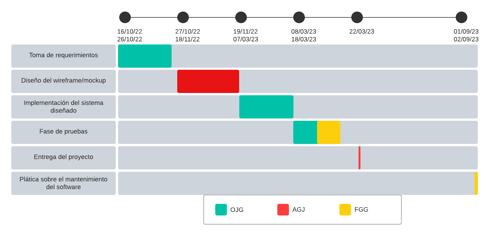

# Abogabot - Requerimientos del proyecto

---
## 1. Descripción de la solicitud

### *Usuario solicitante*

Debido al avance tecnológico y la tendencia por la digitalización de los procesos. La empresa Abogados unidos S. A de C. V. Quiere brindar sus servicios de manera online mediante la implementación de un sitio web con nombre “Abogabot”, se busca que el trato con posibles clientes sea mediante la implementación de un formulario y que también pueda pagar por el servicio que desee. Por lo anterior se deberá contar con un inicio de sesión, ya que también entre sus opciones se busca que el cliente pueda ver el seguimiento de su solicitud, lo anterior desde la parte del cliente.
Como administradores de la página se necesita de un panel especial que capte toda la información de solicitudes realizada, genere documentos prellenados con la información que el cliente puso en el formulario y se pueda descargar un documento en formato Word. Cuando entre a cada solicitud podrá cambiar el estatus de la misma de acuerdo a la etapa en la que se encuentre. Como un extra deberá poder enviar comentarios/estatus a los clientes mediante un correo electrónico. Es necesario que también se puedan observar estadísticas directas de cantidad de solicitudes, pagos totales realizados, solicitudes canceladas, solicitudes realizadas.

Debido a las tendencias de la miniaturización y mayor utilización de dispositivos móviles, se cree conveniente que la página web sea responsive.

La tipografía queda a disposición de los desarrolladores, pero en cuanto a otros datos de nuestra identidad creo que sería conveniente que mantengan nuestros colores: azul marino y blanco, aunque no tenemos problemas en aceptar propuestas previas al desarrollo del producto.

### *Líder funcional*
- Es un despacho de abogados que quiere automatizar las demandas de sus clientes, esto lo harán a través de una página web llenando un formulario.
- Al momento de llenar el formulario se manda al proceso de pago para finalizar la transacción.
- Para dar seguimiento a su demanda, el cliente crea una cuenta en la plataforma y verá el seguimiento de cada una de las actualizaciones del proceso legal.
- El administrador del sitio recibe la notificación de una nueva demanda y con los datos llenados del formulario se crea automáticamente el documento legal en formato Word para empezar el proceso.
- El administrador recibe el pago y debe de ser capaz de verlo en un dashboard para ver la cantidad de ingresos recibidos.
- El administrador actualiza el proceso de la demanda y agrega comentarios en cada paso del proceso.
- Al usuario le llegan correos de notificación para saber el avance de su proceso.
- La página debe de ser responsive para poderla ver desde el celular.
- La preferencia de colores del cliente es azul marino y blanco, pero acepta propuestas.

---
## 2. ANALISIS DE REQUISITOS Y REQUERIMIENTOS

### *Alcance de la solución*
El alcance de la solución abarcará a todo México (por ahora), es decir, los clientes y leyes que se tratarán en el sistema que se desea crear serán mexicanos

### *Requerimientos funcionales*
- Autentificación y autorización de los usuarios.
- Formulario en una página web.
- Pasarela de pago.
- Seguimiento de las solicitudes (Información detallada)
- En base al formulario se hace la creación automatizada del documento legal en formato Word.
- Administrador con dashboard.
- El administrador actualiza el proceso de la demanda y agrega comentarios en cada paso del proceso.
- Notificaciones por correo para los usuarios (conocer el estado actual de su proceso).

### *Requerimientos no funcionales*
- Sistema compatible a distintos tamaños de pantallas (responsive).
- Colores preferenciales azul marino y blanco, se aceptan sugerencias.

---
## 3. Diagrama de planeación 

**NOTA:** Las fechas de planeación establecidas en este documento son aproximadas y estarán sujetas a modificaciones que surjan por control de cambios u otros factores. 

---
## 4. Buyer persona

---
## 5. Audiencia
[Ver tipo de audiencia en Miro](https://miro.com/app/live-embed/uXjVPNUIFLw=/?moveToViewport=934,-163,3457,1055&embedId=663454855673)

---
## 6. Wireframe general
[Ver wireframe de Abogabot en Miro](https://miro.com/app/live-embed/uXjVPNUb3LU=/?moveToViewport=-2123,-1472,13264,3559&embedId=857525961566)

---
## 7. Prototipo del proyecto
- Cliente (Escritorio - Móvil)
- Adminitrador (Escritorio)
[Ver prototipos en Figma](https://www.figma.com/embed?embed_host=share&url=https%3A%2F%2Fwww.figma.com%2Fproto%2FxMU3jMXnWE0BRekPkaxeLT%2FAbogabot%3Fnode-id%3D6%253A1017%26scaling%3Dscale-down%26page-id%3D0%253A1%26starting-point-node-id%3D2%253A12%26show-proto-sidebar%3D1)

